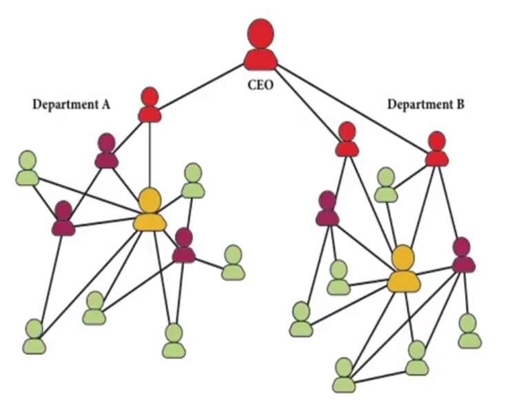

# Org Chart Graph Dataset

An implementation of the Org Chart dataset from SNAP's [Learning Structural Node Embeddings via Diffusion Wavelets](https://www.youtube.com/watch?v=S4QZiUPJkRI) video.

Delivered in TU Dortmund's Graph Kernel Dataset [format](https://ls11-www.cs.tu-dortmund.de/staff/morris/graphkerneldatasets#file_format).

 Let

    n = total number of nodes
    m = total number of edges
    N = number of graphs

    OrgChart_A.txt (m lines): sparse (block diagonal) adjacency matrix for all graphs, each line corresponds to (row, col) resp. (node_id, node_id). All graphs are undirected. Hence, OrgChart_A.txt contains two entries for each edge.
    OrgChart_graph_indicator.txt (n lines): column vector of graph identifiers for all nodes of all graphs, the value in the i-th line is the graph_id of the node with node_id i
    OrgChart_graph_labels.txt (N lines): class labels for all graphs in the data set, the value in the i-th line is the class label of the graph with graph_id i
    OrgChart_node_labels.txt (n lines): column vector of node labels, the value in the i-th line corresponds to the node with node_id i

There are optional files if the respective information is available:

    DS_edge_labels.txt (m lines; same size as DS_A_sparse.txt): labels for the edges in DS_A_sparse.txt
    DS_edge_attributes.txt (m lines; same size as DS_A.txt): attributes for the edges in DS_A.txt
    DS_node_attributes.txt (n lines): matrix of node attributes, the comma seperated values in the i-th line is the attribute vector of the node with node_id i
    DS_graph_attributes.txt (N lines): regression values for all graphs in the data set, the value in the i-th line is the attribute of the graph with graph_id i
